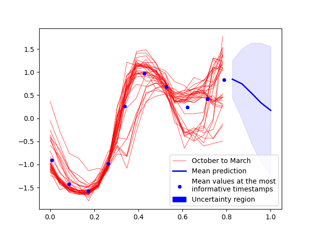
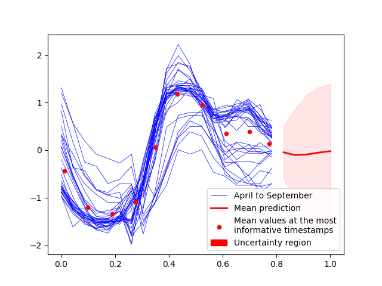
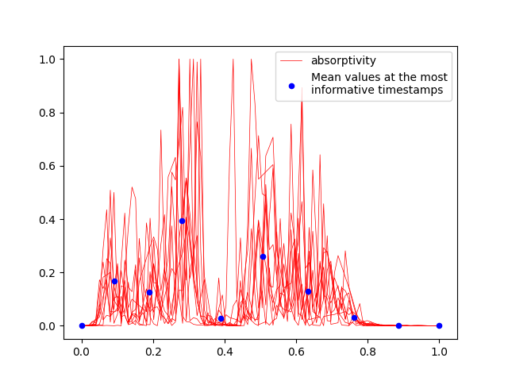
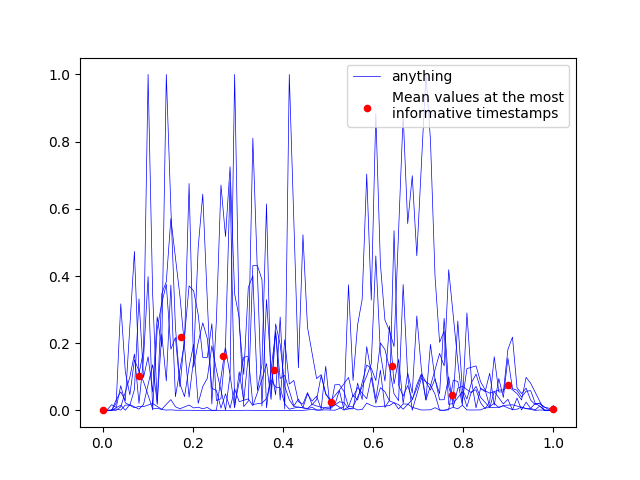

# Motion Code

## I. Introduction
In this work, we employ variational inference and stochastic process modeling to develop a framework called
Motion Code.

### 1. Download datasets and trained models
The trained models for Motion Code is available in the folder `saved_models` due to their small sizes. However, for reproducibility, you need to download the datasets as we cannot store them directly in the repos due to limited storage. In addition to data, the trained attention-based benchmarking models are available
through downloading. To download the datasets and attention-based benchmarking models, follow 3 steps:
1. Go to the download link: https://www.swisstransfer.com/d/0a189451-2aa3-4ffb-8b57-903082d40573 and download
the zip file. 
   * <b>Password</b>: <b>assets_for_motion_code</b>
   
   Note that it can take up to 10 minutes to download the file. Additionally, the link is expired every month,
but this repos is continuously updated and you can always check this README.md for updated link(s)

2. Unzip the downloaded file. Inside the file is `motion_code` folder, which contains 2 sub-folders `data` and `TSLibrary`:
   * The `data` folder contains experiment data (basic noisy datasets, audio and parkinson data). Copy
   this folder to the repo root (if `data` folder already exists in the repo, then copy its content over).
   * `TSLibrary` contain 3 folders, and you need to add these 3 folders to the `TSLibrary` folder of the repo.
   These 3 folders include:
      * `dataset`: contains .ts version of `data` folder
      * `checkpoints`: contains trained attention-based models
      * `results`: contains classification results of attention-based models
      
3. Please make sure that you have `data`, `dataset`, `checkpoints`, and `results` downloaded and stored in
the correct location as instructed above. Once this is done, you're ready to run tutorial notebooks and other
notebooks in the repo.

### 2. Basic usage
Please look at the tutorial notebook `tutorial_notebook.ipynb` to learn how to use Motion Code.
To initialize the model, use the code:
```python
from motion_code import MotionCode
model = MotionCode(m=10, Q=1, latent_dim=2, sigma_y=0.1)
```

For training the Motion Code, use:
```python
model.fit(X_train, Y_train, labels_train, model_path)
```

Motion Code performs both classification and forecasting.
- For the classification task, use:
  ```python
  model.classify_predict(X_test, Y_test)
  ```
- For the forecasting task, use:
  ```python
  mean, covar = model.forecast_predict(test_time_horizon, label=0)
  ```

All package prerequisites are given in `requirements.txt`. You can install by 
```sh
pip install -r requirements.txt
```

## II. Interpretable Features
To learn how to generate interpretable features, please see `Pronunciation_Audio.ipynb` for further tutorial.
This notebook gets the audio data, trains a Motion Code model on the data, and plots the interpretable features
obtained from Motion Code's most informative timestamps.

Here are some examples of <b>the most informative timestamps</b> features extracted from Motion Code
that captures different underlying dynamics:

Humidity sensor (MoteStrain)                 |  Temperature sensor (MoteStrain)
:-------------------------:|:-----------------------------:
  |  

Winter power demand (ItalyPowerDemand)              |  Spring power demand (ItalyPowerDemand)
:-------------------------:|:-------------------------:
  |  

Word "absortivity" (Pronunciation audio)              |  Word "anything" (Pronunciation audio) 
:-------------------------:|:-------------------------:
  |  

<br></br>

## III. Benchmarking
The main benchmark file is `benchmarks.py`.
For benchmarking models, we consider two types: 
* Non attention-based and our model
* Attention-based model such as Informer or Autoformer

You can get all classification benchmarks in a highlighted manner by running the notebook `collect_all_benchmarks.ipynb`. Once the run is completed, the output `out/all_classification_benchmark_results.html` will contain all classification benchmark results. To further doing more customize steps, you can follow additional instructions below:

### 2. Non Attention-Based Method
#### Running Benchmarks:
1. Classification benchmarking on basic dataset with noise:
   ```sh
   python benchmarks.py --dataset_type="basics" --load_existing_model=True --load_existing_data=True --output_path="out/classify_basics.csv"
   ```
2. Forecasting benchmarking on basic dataset with noise:
   ```sh
   python benchmarks.py --dataset_type="basics" --forecast=True --load_existing_model=True --load_existing_data=True --output_path="out/forecast_basics.csv"
   ```
3. Classification and forecasting benchmarking on (Pronunciation) Audio dataset:
   ```sh
   python benchmarks.py --dataset_type="pronunciation" --load_existing_model=True --load_existing_data=True --output_path="out/classify_pronunciation.csv"
   python benchmarks.py --dataset_type="pronunciation" --forecast=True --load_existing_model=True --load_existing_data=True --output_path="out/forecast_pronunciation.csv"
   ```
4. Benchmarking on Parkinson data for either PD setting 1 or PD setting 2:
   ```sh
   python benchmarks.py --dataset_type="parkinson_1" --load_existing_model=True --output_path="out/classify_parkinson_1.csv"
   python benchmarks.py --dataset_type="parkinson_2" --load_existing_model=True --output_path="out/classify_parkinson_2.csv"
   ```

### 3. Attention-Based Method
We will use the Time Series Library ([TSLibrary](https://github.com/thuml/Time-Series-Library/)), stored in the `TSLibrary` folder.
To rerun all training, execute the script:
```sh
bash TSLibrary/attention_benchmark.sh
```
For efficiency, it is recommended to use existing (already) trained models and run `collect_all_benchmarks.ipynb` to get the benchmark results.

### 4. Hyperparameter Details
#### Classification:
- **DTW:** `distance="dtw"`
- **TSF:** `n_estimators=100`
- **BOSS-E:** `max_ensemble_size=3`
- **Shapelet:** `estimator=RotationForest(n_estimators=3)`, `n_shapelet_samples=100`, `max_shapelets=10`, `batch_size=20`
- **SVC:** `kernel=mean_gaussian_tskernel`
- **LSTM-FCN:** `n_epochs=200`
- **Rocket:** `num_kernels=500`
- **Hive-Cote 2:** `time_limit_in_minutes=0.2`
- **Attention-based parameters**: Refer to `TSLibrary/attention_benchmark.sh`

#### Forecasting:
- **Exponential Smoothing:** `trend="add"`, `seasonal="additive"`, `sp=12`
- **ARIMA:** `order=(1, 1, 0)`, `seasonal_order=(0, 1, 0, 12)`
- **State-space:** `level="local linear trend"`, `freq_seasonal=[{"period": 12, "harmonics": 10}]`
- **TBATS:** `use_box_cox=False`, `use_trend=False`, `use_damped_trend=False`, `sp=12`, `use_arma_errors=False`, `n_jobs=1`

## IV. Visualization
The main visualization file is `visualize.py`.

### 1. Motion Code Interpretability
To extract interpretable features from Motion Code, run:
```sh
python visualize.py --type="classify_motion_code" --dataset="PD setting 2"
```
Change the dataset argument as needed (e.g., `Pronunciation Audio`, `PD setting 1`, `PD setting 2`).

### 2. Forecasting Visualization
1. To visualize forecasting with mean and variance:
   ```sh
   python visualize.py --type="forecast_mean_var" --dataset="ItalyPowerDemand"
   ```
2. To visualize forecasting with informative timestamps:
   ```sh
   python visualize.py --type="forecast_motion_code" --dataset="ItalyPowerDemand"
   ```

## V. File Structure
1. **Tutorial notebooks:** `tutorial_notebook.ipynb`, `Pronunciation_Audio.ipynb`
2. **`data` folder:**  Contains three subfolders:
   - `basics`: Basic datasets with noise.
   - `audio`: Pronunciation Audio dataset.
   - `parkinson`: Parkinson sensor dataset.
3. **`saved_models` folder:** Contains (already) trained Motion Code models for inference and benchmarking.
4. **Python files:**
   - **Data processing:** `data_processing.py`, `parkinson_data_processing.py`, `utils.py`
   - **Motion Code model:** `motion_code.py`, `motion_code_utils.py`, `sparse_gp.py`
   - **Benchmarking:** `benchmark.py` (Non-attention), `collect_all_benchmarks.ipynb` (All)
   - **Visualization:** `visualize.py`
   - **Other notebooks**: Under notebooks folder are `MotionCodeTSC_create.ipynb` to convert .npy to .ts data
   and `Pronunciation_Audio.ipynb` for extracting intepretable feature from varying-length audio data
5. **Time Series Library `TSLibrary` folder :**  contains `attention_benchmark.sh` for re-running all attention-based benchmarking models training.
